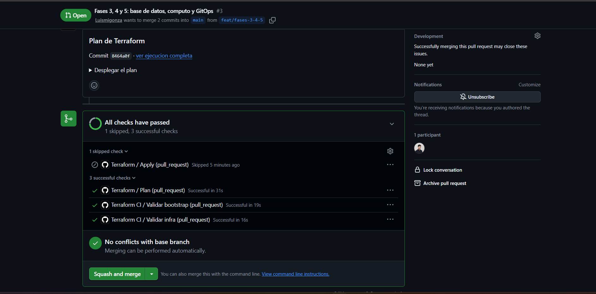
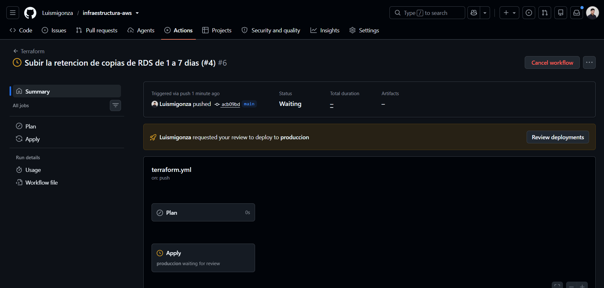
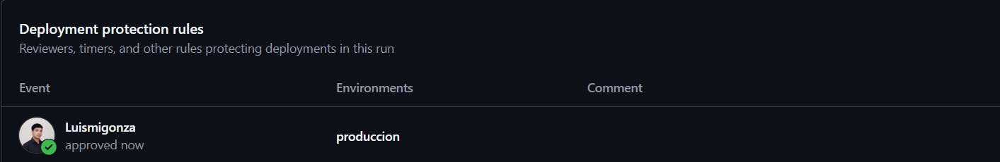
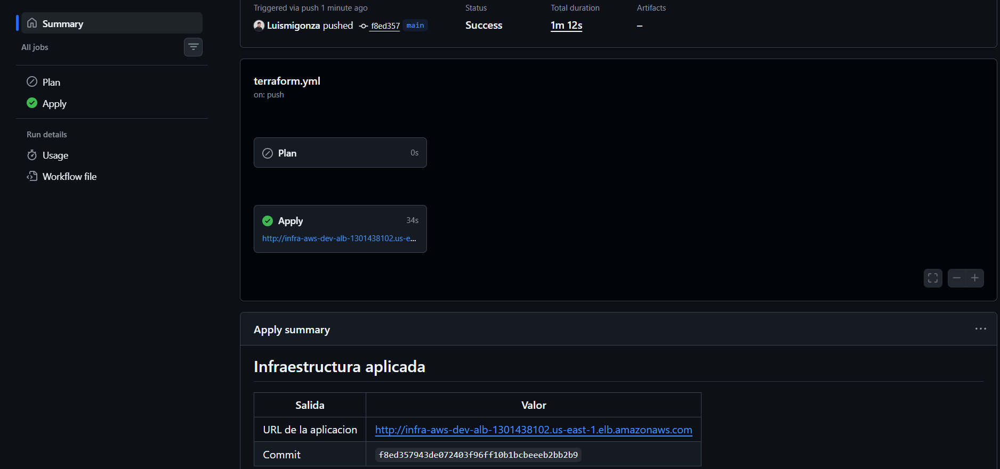
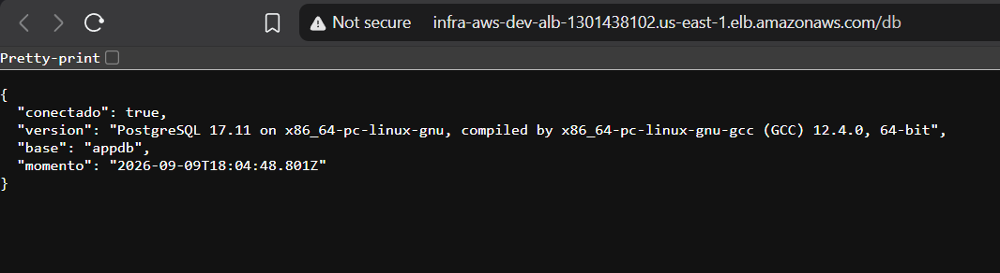
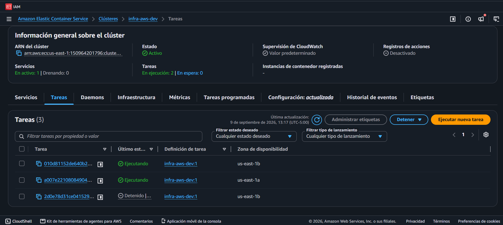

# Plataforma reproducible en AWS con Terraform y GitOps

Infraestructura de una aplicación web en AWS definida **enteramente en código**.
Nada se crea a mano en la consola: si no está en un archivo `.tf`, no existe.
Los cambios de infraestructura se revisan en Pull Requests igual que el código
de una aplicación, y se aplican solos cuando alguien los aprueba.

> **Estado:** completo. La aplicación se despliega con un `terraform apply`,
> los cambios de infraestructura pasan por Pull Request con el plan comentado, y
> el ambiente entero se destruye con un comando.

---

## Arquitectura

```
                    Internet
                        │
                        ▼
        ┌───────────────────────────────┐
        │  Application Load Balancer    │   subnets públicas, 2 AZ
        └───────────────┬───────────────┘
                        │
                        ▼
        ┌───────────────────────────────┐
        │  ECS Fargate (contenedor)     │   subnets privadas, 2 AZ
        └───────────────┬───────────────┘
                        │
                        ▼
        ┌───────────────────────────────┐
        │  RDS PostgreSQL               │   subnets privadas, sin salida
        └───────────────────────────────┘
```

Todo dentro de una VPC propia. Las subnets privadas salen a internet a través de
un NAT Gateway; nadie desde internet puede alcanzarlas.

### Verificación de la red

Una subnet no es «pública» o «privada» por ninguna propiedad suya: lo que la
define es a dónde apunta su tabla de rutas. Comprobado contra la API de AWS
sobre el ambiente real:

```
SUBNET                     AZ           CIDR             TIER     RUTA 0.0.0.0/0 ->
subnet-01312b7174c413fb7   us-east-1b   10.42.241.0/24   public   igw-063f9dd5a2951817d
subnet-0a1563b7e75881f30   us-east-1a   10.42.240.0/24   public   igw-063f9dd5a2951817d
subnet-06a1f9685f7c516e8   us-east-1b   10.42.16.0/20    private  nat-0171bbc8d0570958f
subnet-0f7019b663f415c1a   us-east-1a   10.42.0.0/20     private  nat-0171bbc8d0570958f

NAT nat-0171bbc8d0570958f  estado=available  vive en subnet public (us-east-1a)
VPC Endpoint vpce-0aa227a…  com.amazonaws.us-east-1.s3  Gateway  tablas asociadas=2
```

Lo que **no** aparece importa tanto como lo que sí: ninguna tabla privada tiene
ruta hacia el Internet Gateway. La base de datos no es inalcanzable desde fuera
por un firewall, sino porque no existe un camino hasta ella.

Las subnets privadas son `/20` (4.091 direcciones usables) porque cada tarea de
Fargate consume una IP propia; las públicas son `/24` (251) porque solo alojan
el balanceador y el NAT. AWS reserva 5 direcciones en cada subnet, de ahí que no
sean 4.096 y 256.

### Verificación de la alta disponibilidad

```
AZ            IP privada      Estado    En el balanceador
us-east-1a    10.42.12.13     RUNNING   healthy
us-east-1b    10.42.26.251    RUNNING   healthy
```

Auto scaling en `min 2 / max 3`, por uso medio de CPU al 60 %. Si `us-east-1a`
cayera entera, el balanceador seguiría sirviendo desde `1b`.

### Verificación de la cadena completa

```
$ curl http://infra-aws-dev-alb-....us-east-1.elb.amazonaws.com/db
{
  "conectado": true,
  "version": "PostgreSQL 17.11 on x86_64-pc-linux-gnu...",
  "base": "appdb",
  "momento": "2026-09-09T17:40:54.692Z"
}
```

Esa respuesta demuestra el recorrido entero: internet → balanceador en subnet
pública → tarea de Fargate en subnet privada → PostgreSQL en otra subnet
privada, con una credencial que ningún humano ha visto.

---

## Estructura del repositorio

| Ruta | Qué contiene |
|---|---|
| `bootstrap/` | Lo que debe existir antes que Terraform pueda gestionar nada: bucket de estado, cerrojo y presupuesto. Se aplica una vez. |
| `infra/` | El stack principal. Ensambla los módulos. |
| `infra/modules/network/` | VPC, subnets, Internet Gateway, NAT Gateway, tablas de rutas. |
| `infra/modules/database/` | RDS PostgreSQL, Security Groups, secreto de credenciales. |
| `infra/modules/compute/` | ECR, tarea y servicio de ECS Fargate, auto scaling. |
| `infra/modules/loadbalancer/` | Application Load Balancer, target group, health checks. |
| `app/` | Aplicación de ejemplo y su `Dockerfile`. |
| `.github/workflows/` | Pipelines de `plan` en PR y `apply` en merge. |
| `docs/` | Política IAM y material de apoyo. |

Los dos stacks (`bootstrap` e `infra`) tienen **estados separados** dentro del
mismo bucket. Cada uno se aplica y se destruye sin tocar al otro.

---

## Decisiones técnicas

Cada decisión no obvia está justificada. El *porqué* importa más que el *qué*.

### Usuario IAM con permisos acotados, no `AdministratorAccess`

La política está versionada en [`docs/iam-policy-terraform.json`](docs/iam-policy-terraform.json)
y concede acceso solo a los servicios que este proyecto usa. Está verificado que
**no** puede leer la organización ni crear otros usuarios IAM:

```
$ aws organizations describe-organization
AccessDeniedException: You don't have permissions to access this resource.

$ aws iam create-user --user-name prueba
AccessDenied: ... is not authorized to perform: iam:CreateUser
```

Crear ese usuario es el único paso manual del proyecto, y es inevitable:
Terraform necesita credenciales para funcionar, y esas credenciales son a su vez
un recurso de AWS. Alguien tiene que abrir la puerta la primera vez.

### CIDR `10.42.0.0/16`

- `10.0.0.0/16` es el valor por defecto de casi todos los tutoriales y módulos
  públicos. Elegirlo garantiza un choque el día que esta VPC se empareje con
  otra red o con una VPN.
- `172.31.0.0/16` ya está ocupado: es el rango de la VPC por defecto que AWS
  crea en toda cuenta nueva, incluida esta.
- `192.168.0.0/16` es el rango típico de routers domésticos. Quien se conecte
  por VPN desde su casa tendría el mismo rango en ambos extremos.

`10.42.0.0/16` está en el espacio privado de la RFC 1918, deja 65.536
direcciones y no colisiona con ninguno de los tres.

### Un solo NAT Gateway, no uno por zona

| Opción | Costo/mes | Qué ganas / qué pierdes |
|---|---|---|
| Un NAT por AZ | ~64 USD | Alta disponibilidad real de la salida a internet |
| **Un solo NAT** | **~32 USD** | Si esa AZ cae, las privadas pierden salida |
| NAT instance (`t4g.nano`) | ~3 USD | Mucho más barato; hay que parchar el SO y gestionarlo |
| Solo VPC endpoints, sin NAT | ~58 USD | Suena elegante, sale **más caro**: 4 endpoints × 2 AZ |

Perder el NAT no tumba la aplicación: el balanceador sigue recibiendo tráfico y
las tareas siguen respondiendo. Lo único que se rompe es que las tareas no
pueden *iniciar* conexiones salientes. Pagar el doble por eso en un ambiente que
vive horas no se justifica.

Es una variable, no una constante: `single_nat_gateway = false` crea uno por AZ
y cada tabla de rutas privada pasa a usar el de su zona, sin tocar nada más. En
producción, con tráfico real, esa es la respuesta correcta.

### Endpoint de S3 tipo Gateway

Todo byte que sale por el NAT Gateway se cobra a 0,045 USD/GB. Las imágenes de
contenedor de ECR se almacenan por debajo en S3, así que sin este endpoint cada
despliegue pagaría peaje por descargar su propia imagen.

Los endpoints de tipo **Gateway** son gratuitos (los de tipo *Interface* cuestan
~0,01 USD/hora por AZ). El tráfico hacia S3 deja de atravesar el NAT y deja de
generar cargo.

### La contraseña de la base de datos no existe en ninguna parte tuya

La forma que enseñan casi todos los tutoriales:

```hcl
resource "random_password" "db" { length = 32 }
resource "aws_db_instance" "main" { password = random_password.db.result }
```

Funciona, y tiene un agujero: `random_password` guarda el valor **en texto
plano dentro del estado de Terraform**, que vive en S3. Cualquiera con permiso
de lectura sobre ese bucket la ve.

Aquí se usa `manage_master_user_password = true`: RDS la genera él mismo, la
guarda en Secrets Manager y Terraform nunca la ve. Comprobado sobre el estado
real:

```
Tamaño del estado                : 49.012 caracteres
Atributos con valor de contraseña: 1
  ('aws_db_instance', 'this', 'manage_master_user_password', 'True')
```

El único acierto es el propio booleano. De regalo, como AWS es dueño del
secreto, la rotación automática viene activada sin configurar nada.

### El "pase de entrada" a la base de datos

El enunciado pide que RDS solo acepte tráfico desde el Security Group de ECS.
Pero ECS necesita el endpoint de la base de datos para arrancar, y la base de
datos necesita el Security Group de ECS para su regla: cada uno depende del
otro y Terraform no puede ordenar el grafo.

La salida es que el módulo de base de datos exporta un **segundo Security Group
vacío**, sin ninguna regla, que funciona como etiqueta. La regla dice «acepto
conexiones de quien lleve este pase», y las tareas de ECS se lo cuelgan junto
al suyo. La base de datos define su política de acceso sin conocer a sus
clientes.

Verificado sobre el ambiente real:

```
DesdeIP  DesdeSG                 Puerto
None     sg-05de18c5204a2bcc6    5432
```

`DesdeIP: None` es lo importante: ni `0.0.0.0/0`, ni siquiera el CIDR de la VPC
completa (que dejaría entrar a cualquier cosa lanzada ahí dentro por descuido).

Y desde fuera, la base de datos sencillamente no está:

```
$ nslookup infra-aws-dev-postgres...rds.amazonaws.com
Address: 10.42.3.59            <- IP privada, dentro de la VPC

$ (conexión al puerto 5432 desde una máquina de casa)
INALCANZABLE
```

### El health check no consulta la base de datos

`/health` responde sin tocar PostgreSQL, a propósito. Si lo hiciera, una caída
de RDS haría que el balanceador marcara todas las tareas como muertas y ECS las
reemplazara en bucle: un problema de base de datos se convertiría en una caída
total del servicio.

El health check responde a «¿este proceso está vivo?», no a «¿está todo el
sistema perfecto?». Para lo segundo está `/db`, que es diagnóstico y no una
sonda.

### Fargate y no EC2

Con EC2 alquilas máquinas: pagas por ellas estén ocupadas o no, y te toca
parchear el sistema operativo, vigilar el disco y gestionar el agente de ECS.
Con Fargate declaras cuánta CPU y memoria necesita el contenedor y AWS pone el
resto.

EC2 gana cuando hay carga constante y alta, o cuando hace falta algo que Fargate
no ofrece (GPUs, un kernel concreto). Nada de eso aplica aquí.

### Dos roles de IAM para ECS, no uno

- El rol de **ejecución** lo usa la infraestructura de ECS *antes* de que el
  código arranque: descargar la imagen, escribir logs, leer el secreto.
- El rol de **tarea** lo usa el código ya corriendo, para llamar a otras APIs.

Separarlos significa que si alguien compromete la aplicación, **no hereda el
permiso de leer secretos**: ese permiso lo tuvo el agente de ECS, no el proceso.
El rol de tarea de este proyecto va deliberadamente vacío, porque la aplicación
solo habla con PostgreSQL.

### El primer despliegue tiene un orden obligatorio

El servicio de ECS arranca tareas que descargan una imagen de ECR, pero ECR lo
crea Terraform. Aplicar todo de una vez deja el servicio apuntando a una imagen
inexistente y las tareas entran en bucle de fallos.

```bash
terraform apply -target module.compute.aws_ecr_repository.app   # 1
docker build && docker push                                     # 2
terraform apply                                                 # 3
```

`-target` está desaconsejado para uso rutinario, y con razón. Este es el caso
excepcional para el que existe: romper un ciclo de arranque.

### Lo que un `plan` no puede anticipar

Al probar el flujo de GitOps se intentó subir la retención de copias de RDS de
1 a 7 días. El `plan` salió limpio (`~ backup_retention_period = 1 -> 7`,
actualización en sitio) y el `apply` falló:

```
FreeTierRestrictionError: The specified backup retention period exceeds
the maximum available to free tier customers.
```

Es una restricción **comercial** de la cuenta, no del código. `terraform plan`
compara la configuración contra el estado y consulta la API para refrescar,
pero no conoce las políticas de facturación de AWS. Hay una clase de fallos que
solo aparece al aplicar, y por eso importan tanto dos cosas que ya estaban en
el diseño:

- El **`apply` detenido tras aprobación manual**, para que un fallo así ocurra
  cuando alguien está mirando.
- Que un `apply` fallido **no deje el sistema roto**. Se verificó: la base de
  datos siguió `available`, la aplicación siguió respondiendo `HTTP 200` y el
  cerrojo del estado se liberó correctamente.

Hubo, eso sí, una consecuencia sutil: el estado quedó anotando `7` mientras AWS
seguía en `1`. Si el estado fuera la verdad, el siguiente `plan` habría dicho
«todo en orden» y el cambio nunca se habría aplicado sin que nadie lo notara.
No ocurre porque **`terraform plan` refresca contra AWS antes de comparar**: el
estado es una caché, no la fuente de verdad. El plan siguiente volvió a mostrar
`1 -> 7` correctamente.

La retención se dejó en 1 día —el mínimo distinto de cero, que cumple el
requisito de tener copias activadas— con la limitación documentada en
`infra/variables.tf`.

### Dos tareas mínimas, no una

Tener subnets en dos zonas de disponibilidad **no da alta disponibilidad por sí
solo**. Hacen falta tareas *en* esas dos zonas.

Con `min_tasks = 1`, si esa única tarea muere o cae su AZ, el servicio queda
caído entre 60 y 90 segundos hasta que ECS levante otra. Con 2, ECS las reparte
entre `us-east-1a` y `us-east-1b` y la caída de una zona entera deja el
servicio en pie. El costo añadido es una tarea de 0,25 vCPU: unos 0,012 USD por
hora.

### GitHub Actions entra a AWS sin ningún secreto

Lo habitual es crear una llave de IAM y pegarla en los secretos del
repositorio. Tres problemas: no caduca nunca, vive en un sistema que no
controlas, y quien la extraiga puede usarla desde cualquier lugar del mundo.

OIDC invierte la relación. GitHub firma un token que afirma *«soy el
repositorio X, corriendo en la rama Y»*. AWS verifica la firma contra las claves
públicas de GitHub y entrega credenciales **temporales de una hora**. No hay
ningún secreto que robar, porque no hay ningún secreto.

Lo que decide si esto es seguro o inútil es la condición de confianza. El error
habitual es `repo:*:*`, que permitiría a **cualquier repositorio de GitHub**
—el de un desconocido incluido— operar en tu cuenta. Aquí se enumeran tres
situaciones y ninguna más:

```
repo:Luismigonza/infraestructura-aws:ref:refs/heads/main
repo:Luismigonza/infraestructura-aws:pull_request
repo:Luismigonza/infraestructura-aws:environment:produccion
```

El rol del pipeline usa **el mismo archivo de política** que el usuario local
(`docs/iam-policy-terraform.json`). Si mañana se añade un servicio, se edita un
solo sitio: no hay forma de que el pipeline y tu máquina se desincronicen sin
que nadie lo note.

### Doble mecanismo de bloqueo del estado

Sin cerrojo, dos `apply` simultáneos (tu máquina y el pipeline) parten de fotos
distintas de la realidad y el último en escribir pisa al otro.

El enunciado pide DynamoDB. Desde Terraform 1.10 el backend S3 sabe bloquear por
sí solo (`use_lockfile`) y `dynamodb_table` quedó **obsoleto**. Se mantienen los
dos: DynamoDB porque es requisito, y el bloqueo nativo porque el otro va camino
de desaparecer. El día que lo eliminen, se borra una línea y el cerrojo sigue
funcionando.

Consecuencia visible: `terraform init` imprime un aviso de parámetro obsoleto.
Es esperado, no un error.

### `force_destroy = true` en el bucket de estado

En producción se pondría `false` más `prevent_destroy`: borrar el estado por
accidente es catastrófico. Aquí se deja en `true` a propósito, porque el ciclo
de vida esperado de este proyecto incluye desmontarlo por completo y el
`terraform destroy` tiene que funcionar limpio de verdad. La red de seguridad
que se pierde la compensa el versionado del bucket.

### El nombre del bucket se calcula, no se escribe

Los nombres de bucket S3 son únicos **globalmente**. El bootstrap lo construye
como `tfstate-<proyecto>-<id-de-cuenta>`, tomando el ID de cuenta de las
credenciales activas. Así el mismo código funciona en la cuenta de cualquiera
sin editar nada.

Eso choca con una limitación de Terraform: los bloques `backend` no admiten
variables ni interpolación. La salida es la *configuración parcial*: el backend
declara solo su tipo y los valores concretos llegan en un `backend.hcl` que el
bootstrap **genera automáticamente**. Ese archivo no se versiona, porque es
específico de cada cuenta.

### El backend se autentica aparte del provider

Terraform habla con AWS por **dos caminos independientes**, y es una fuente
clásica de confusión:

| Camino | Para qué | De dónde saca las credenciales |
|---|---|---|
| `provider "aws"` | Crear y modificar recursos | `var.aws_profile`, desde `terraform.tfvars` |
| `backend "s3"` | Leer y escribir el estado | **Solo** de `backend.hcl` o del entorno |

El backend se inicializa *antes* de que las variables existan, así que no puede
leer `terraform.tfvars`. Si `backend.hcl` no lleva `profile` y el entorno no
tiene `AWS_PROFILE`, Terraform acaba preguntándole a `169.254.169.254` —la
dirección desde la que una instancia EC2 pide su rol— y falla con un
desconcertante `unreachable network`.

Por eso el bootstrap escribe `profile` dentro del `backend.hcl` que genera. En
CI ese valor es `null` y la línea sencillamente no se emite, porque allí las
credenciales llegan por rol IAM.

Si prefieres no depender de eso, la alternativa es exportar la variable de
entorno, que cubre ambos caminos a la vez:

```powershell
Set-Item Env:AWS_PROFILE infra-aws     # PowerShell
```
```bash
export AWS_PROFILE=infra-aws           # bash
```

### HTTP, no HTTPS *(decisión pendiente de revisar)*

Este proyecto no tiene dominio propio, y AWS Certificate Manager no emite
certificados para el nombre DNS autogenerado de un balanceador. El ALB queda
sirviendo **HTTP en el puerto 80**.

No es una omisión: es una limitación asumida y documentada. Con un dominio, el
cambio son unas veinte líneas (un `aws_acm_certificate`, su validación por DNS,
y un listener en el 443 que redirige el 80).

---

## El flujo de GitOps

Un cambio de infraestructura recorre exactamente el mismo camino que un cambio
de código de aplicación:

```
rama  →  Pull Request  →  la CI valida  →  el plan se publica como comentario
      →  revisión humana  →  merge  →  el apply ESPERA aprobación  →  se aplica
```

| Workflow | Se dispara | Qué hace | Credenciales |
|---|---|---|---|
| `terraform-ci.yml` | cualquier PR o push | `fmt -check` y `validate` sobre ambos stacks | Ninguna |
| `terraform.yml` · `plan` | PR hacia `main` | Planifica y publica el resultado en el PR | OIDC, temporales |
| `terraform.yml` · `apply` | merge a `main` | **Se detiene** en el entorno `produccion` hasta que un revisor aprueba | OIDC, tras aprobar |
| `app-deploy.yml` | cambios en `app/` | Construye la imagen, la sube a ECR, redespliega en ECS | OIDC, temporales |

Detalles que no son evidentes:

- **El comentario del plan se actualiza, no se apila.** Un PR con quince
  commits tendría si no quince planes que hay que ir descartando; así siempre
  hay uno solo y es el vigente.
- **`cancel-in-progress: false`** en el `apply`. Cancelar un `apply` a media
  ejecución deja recursos creados que el estado desconoce: huérfanos que siguen
  cobrando y que Terraform ya no sabe borrar. Es preferible encolar.
- **El `apply` vuelve a planificar y aplica ese archivo**, en vez de un
  `apply -auto-approve` que recalcularía el plan por dentro. Así lo aplicado es
  exactamente lo calculado, y el plan queda impreso en el log justo antes de
  ejecutarse.
- **El despliegue de la aplicación va aparte del de infraestructura**, porque
  son ritmos distintos. El código cambia a diario; la forma de la
  infraestructura casi nunca. Mezclarlos obligaría a pasar por la aprobación
  manual cada vez que se corrige una línea de la app.
- **Rollback:** cada imagen se etiqueta también con el SHA del commit, así que
  volver a una versión concreta es `terraform apply -var image_tag=<sha>`.

### Configuración necesaria en GitHub

Estos pasos se hacen una vez. Ninguno guarda un secreto.

```bash
# Entorno protegido con revisor obligatorio (requiere repo público en el plan gratuito)
'{"reviewers":[{"type":"User","id":TU_ID_NUMERICO}]}'   | gh api --method PUT repos/OWNER/REPO/environments/produccion --input -

# Variables del repositorio (valores que devuelve `terraform output`)
gh variable set AWS_ROLE_ARN    --body "<github_actions_role_arn del bootstrap>"
gh variable set AWS_REGION      --body "us-east-1"
gh variable set TF_STATE_BUCKET --body "<state_bucket del bootstrap>"
gh variable set TF_LOCK_TABLE   --body "<lock_table del bootstrap>"
gh variable set ECR_REPOSITORY  --body "<nombre del repositorio de ECR>"
gh variable set ECS_CLUSTER     --body "<ecs_cluster_name>"
gh variable set ECS_SERVICE     --body "<ecs_service_name>"
gh variable set APP_URL         --body "<app_url>"
```

> **Nota sobre el plan gratuito de GitHub:** las reglas de protección de
> entornos solo están disponibles en repositorios **públicos** (en cualquier
> plan) o en privados con GitHub Pro o superior. Este repositorio es público en
> parte por esa razón. Los comentarios del plan muestran ARNs que incluyen el ID
> de la cuenta de AWS, que no es una credencial y no sirve de nada sin llaves.

---

## Evidencia

El recorrido completo de un cambio de infraestructura, desde que se propone
hasta que toca AWS.

### 1. El plan se publica en el Pull Request



GitHub Actions se autentica en AWS por OIDC, calcula el plan y lo deja como
comentario. Fíjate en `Terraform / Apply — Skipped`: en un Pull Request el
`apply` ni siquiera se ejecuta. Solo se mira, no se toca.

### 2. El apply se detiene y espera a una persona



El cambio ya está fusionado en `main` y el workflow arrancó, pero el estado es
**`Waiting`**. Ese job todavía **no tiene credenciales de AWS**: GitHub no se
las entrega hasta que alguien autoriza. No es un aviso que se pueda ignorar; es
una puerta cerrada.

### 3. Queda registrado quién autorizó



La aprobación no es un clic que se pierde: queda como evento del despliegue, con
autor y momento. Es la diferencia entre una convención de equipo y un control
auditable.

### 4. Se aplica, y se sabe exactamente qué



El resumen registra la URL resultante y el SHA del commit aplicado. Cualquiera
puede responder «¿qué versión está corriendo?» sin adivinar.

### 5. La aplicación responde, y llega hasta la base de datos



`"conectado": true` con la versión de PostgreSQL significa que la petición viajó
desde internet al balanceador, de ahí a una tarea de Fargate en una subnet
privada, y de ahí a RDS en otra subnet privada — con una credencial que ningún
humano ha visto.

El aviso **«Not secure»** del navegador no es un descuido: es la decisión de
[servir por HTTP](#http-no-https-decisión-pendiente-de-revisar) al no disponer
de un dominio propio, visible en lugar de escondida.

### 6. Dos tareas, dos zonas de disponibilidad



`En ejecución: 2`, una en `us-east-1a` y otra en `us-east-1b`. Tener subnets en
dos zonas no da alta disponibilidad por sí solo: hacen falta tareas *en* esas
zonas.

La tercera fila, en `Detenido`, es la tarea única que existía antes de este
cambio. ECS levantó las dos nuevas, esperó a que el balanceador las diera por
sanas, y solo entonces retiró la vieja. El servicio no dejó de responder en
ningún momento.

---

## Costos

| Recurso | Costo aproximado |
|---|---|
| **NAT Gateway** | **~32 USD/mes** — el componente caro, no está en capa gratuita |
| Application Load Balancer | ~16 USD/mes |
| RDS `db.t3.micro` | gratis el primer año, luego ~13 USD/mes |
| ECS Fargate (2 tareas mínimas, una por AZ) | ~18 USD/mes |
| S3 + DynamoDB (estado) | céntimos |
| AWS Budgets | gratis |

Por eso el ambiente **se levanta para trabajar y se destruye al terminar**. Hay
una alerta de presupuesto configurada desde antes de crear el primer recurso,
con avisos al 50 %, al 80 % y una proyección al 100 %. La proyección es la que
sirve: avisa el día 3 de que a ese ritmo te pasarás a fin de mes, no cuando el
dinero ya se gastó.

---

## Cómo levantar el ambiente desde cero

### Requisitos

- [Terraform](https://developer.hashicorp.com/terraform) >= 1.6
- [AWS CLI](https://aws.amazon.com/cli/) v2
- Una cuenta de AWS

### 1. Crear el usuario de Terraform *(una sola vez, a mano)*

En la consola de AWS:

1. **IAM → Policies → Create policy → JSON**: pega el contenido de
   [`docs/iam-policy-terraform.json`](docs/iam-policy-terraform.json) y nómbrala
   `TerraformPlatformDeploy`.
2. **IAM → Users → Create user**: nombre `terraform-infra-aws`, **sin** acceso a
   la consola, y adjunta la política anterior.
3. En el usuario, **Security credentials → Create access key → CLI**.

Configura el perfil local:

```bash
aws configure --profile infra-aws
```

### 2. Aplicar el bootstrap

Crea el bucket de estado, el cerrojo y la alerta de presupuesto.

```bash
cd bootstrap
cp terraform.tfvars.example terraform.tfvars   # pon tu correo de alertas
terraform init
terraform plan -out tfplan
terraform apply tfplan
```

Mueve su propio estado al bucket que acaba de crear:

```bash
terraform init -migrate-state -backend-config backend.hcl
```

Responde `yes` cuando pregunte si quiere copiar el estado existente. Responder
`no` haría que Terraform se olvidara de los recursos recién creados, que
seguirían existiendo y cobrando.

> El `terraform.tfvars` del bootstrap necesita también los datos de tu
> repositorio de GitHub, incluidos los **IDs numéricos**. No son opcionales:
> GitHub emite el sujeto del token OIDC como
> `repo:owner@<owner_id>/repo@<repo_id>:contexto`, y sin ellos la autenticación
> del pipeline falla. Obténlos con:
>
> ```bash
> gh api repos/OWNER/REPO --jq '"owner_id=\(.owner.id) repo_id=\(.id)"'
> ```

### 3. Crear el repositorio de imágenes y publicar la primera

Este paso tiene un orden obligatorio. El servicio de ECS arranca tareas que
descargan una imagen de ECR, pero ECR lo crea Terraform: aplicar todo de una vez
deja el servicio apuntando a una imagen inexistente y las tareas entran en bucle
de fallos.

```bash
cd ../infra
cp terraform.tfvars.example terraform.tfvars
terraform init -backend-config backend.hcl

# Solo el repositorio de imágenes (arrastra el balanceador por dependencia)
terraform apply -target module.compute.aws_ecr_repository.app
```

Construye y sube la imagen al repositorio recién creado:

```bash
REPO=$(terraform output -raw ecr_repository_url)

aws ecr get-login-password --region us-east-1 --profile infra-aws   | docker login --username AWS --password-stdin "${REPO%%/*}"

docker build --platform linux/amd64 -t "$REPO:latest" ../app
docker push "$REPO:latest"
```

### 4. Aplicar el resto

```bash
terraform plan -out tfplan
terraform apply tfplan
```

La URL de la aplicación sale como output al terminar:

```bash
terraform output -raw app_url
```

Las tareas tardan un par de minutos en arrancar, descargar la imagen y pasar el
health check. Para esperar a que el servicio esté listo:

```bash
aws ecs wait services-stable   --cluster "$(terraform output -raw ecs_cluster_name)"   --services "$(terraform output -raw ecs_service_name)"   --profile infra-aws
```

Comprueba que la cadena completa funciona:

```bash
curl "$(terraform output -raw app_url)/db"
```

Debe responder con la versión de PostgreSQL, lo que demuestra que la petición
llegó desde internet al balanceador, de ahí a una tarea en una subnet privada, y
de ahí a la base de datos en otra subnet privada.

### 5. Conectar el pipeline *(opcional)*

Si además quieres el flujo de GitOps, sigue
[Configuración necesaria en GitHub](#configuración-necesaria-en-github).

---

## Cómo destruir el ambiente por completo

**El orden importa.** El stack principal primero; el bootstrap al final, porque
guarda el estado de todo lo demás.

### 1. El stack principal

```bash
cd infra
terraform destroy
```

Tarda entre 8 y 12 minutos, y la mayor parte se va en tres esperas propias de
AWS: el balanceador drena las conexiones abiertas, RDS borra la instancia, y el
NAT Gateway libera su interfaz de red.

No hace falta vaciar nada a mano. Tres ajustes puestos a propósito lo permiten,
y los tres están documentados arriba: `force_delete` en ECR (el repositorio se
borra con imágenes dentro), `skip_final_snapshot` en RDS (no exige instantánea
final) y `enable_deletion_protection = false` en el balanceador.

### 2. El bootstrap

Aquí hay un detalle: el bootstrap guarda su propio estado **dentro del bucket
que va a borrar**. Si se destruyera tal cual, Terraform borraría el bucket y
después intentaría escribir en él el estado final. Hay que traerlo al disco
primero.

```bash
cd ../bootstrap

# 1. Comenta la línea `backend "s3" {}` en versions.tf
# 2. Trae el estado de vuelta a tu máquina:
terraform init -migrate-state

# 3. Ahora sí:
terraform destroy
```

Esto borra el bucket de estado, la tabla de cerrojo, la alerta de presupuesto y
el rol de GitHub Actions con su proveedor OIDC.

### 3. Comprobar que no quedó nada huérfano

Un ambiente que se cree destruido pero deja recursos sueltos sigue cobrando.
Este bloque revisa **todo** lo que el proyecto crea:

```bash
export AWS_PROFILE=infra-aws

echo "VPCs:        $(aws ec2 describe-vpcs --query 'length(Vpcs[?IsDefault==`false`])')"
echo "NAT:         $(aws ec2 describe-nat-gateways --query 'length(NatGateways[?State!=`deleted`])')"
echo "IPs fijas:   $(aws ec2 describe-addresses --query 'length(Addresses)')"
echo "Balanceador: $(aws elbv2 describe-load-balancers --query 'length(LoadBalancers)')"
echo "RDS:         $(aws rds describe-db-instances --query 'length(DBInstances)')"
echo "ECS:         $(aws ecs list-clusters --query 'length(clusterArns)')"
echo "ECR:         $(aws ecr describe-repositories --query 'length(repositories)')"
echo "Logs:        $(aws logs describe-log-groups --log-group-name-prefix /ecs/ --query 'length(logGroups)')"
echo "Buckets:     $(aws s3api list-buckets --query 'length(Buckets[?starts_with(Name,`tfstate-`)])')"
echo "DynamoDB:    $(aws dynamodb list-tables --query 'length(TableNames)')"
```

Todo debe salir en `0`.

Las **IPs fijas** son el olvido más caro y el más frecuente: una Elastic IP sin
asociar a nada sigue costando ~3,60 USD al mes precisamente *por* estar ociosa.
AWS cobra por reservarla, no por usarla.

El secreto de la base de datos desaparece con la instancia, porque lo gestiona
RDS y no Terraform. Si lo hubieras creado tú con `aws_secretsmanager_secret`,
quedaría en cuarentena 30 días antes de borrarse de verdad.

### 4. Después

Las variables del repositorio en GitHub (`TF_STATE_BUCKET`, `AWS_ROLE_ARN`…)
quedan apuntando a recursos que ya no existen. No cuesta nada dejarlas, y
volver a levantar el ambiente solo requiere actualizarlas con los nuevos
valores. El usuario de IAM y su llave sobreviven: son el único recurso creado a
mano, y son los que te permiten volver a empezar.

---

## Hoja de ruta

- [x] **Fase 1 — Cimientos.** Backend remoto (S3 + DynamoDB), presupuesto,
      estructura de módulos, usuario IAM acotado.
- [x] **Fase 2 — Red.** VPC, subnets públicas y privadas en 2 AZ, Internet
      Gateway, NAT Gateway, tablas de rutas, endpoint de S3.
- [x] **Fase 3 — Base de datos.** RDS PostgreSQL, Security Groups, credenciales
      gestionadas por AWS en Secrets Manager.
- [x] **Fase 4 — Cómputo y balanceo.** ECR, ECS Fargate, ALB, health checks,
      auto scaling.
- [x] **Fase 5 — GitOps.** `plan` comentado en cada PR, `apply` tras aprobación
      manual en merge, autenticación OIDC sin secretos.
- [x] **Fase 6 — Documentación y evidencia.** Decisiones justificadas,
      instrucciones de arranque y de destrucción verificadas.
